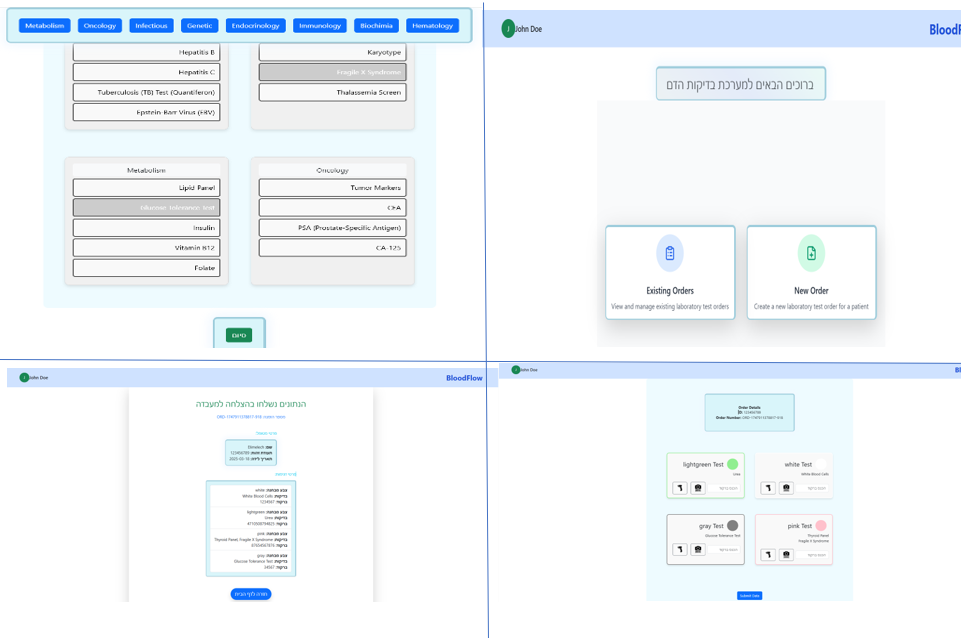

# מערכת להזמנת בדיקות דם למעבדה

מערכת זו נועדה לשמש אחיות ורופאים להזמנת נתוני בדיקות דם מהמעבדה, בצורה דיגיטלית, נוחה ומאובטחת.

## ✨ תיאור המערכת
לאחר שהאחות לוקחת דגימת דם מהמטופל, היא בוחרת אילו דגימות יש לקחת מכל מבחנה, סורקת את הברקוד שעל כל מבחנה, והמערכת שולחת את כל הנתונים הנדרשים (כולל פרטי מטופל ורופא) ישירות למעבדה.

## 🚀 תכונות עיקריות
- הזנת נתוני מטופל ורופא בצורה נוחה
- בחירת סוגי דגימות ומבחנות
- סריקת ברקוד למבחנות
שלושה אפשרויות להזנת ברקוד ע"י הקלדה או צילום במצלמת המחשב או ע"י סריקה בסורק ברקוד אינפרא אדום חיצוני 
- שליחת נתונים מאובטחת למעבדה
- ממשק משתמש ידידותי לאחיות ורופאים

## 📸 צילומי מסך
של חלק ממסכי האתר 

# מערכת להזמנת בדיקות דם למעבדה

מערכת זו נועדה לשמש אחיות ורופאים להזמנת נתוני בדיקות דם מהמעבדה, בצורה דיגיטלית, נוחה ומאובטחת.

## ✨ תיאור המערכת
לאחר שהאחות לוקחת דגימת דם מהמטופל, היא בוחרת אילו דגימות יש לקחת מכל מבחנה, סורקת את הברקוד שעל כל מבחנה, והמערכת שולחת את כל הנתונים הנדרשים (כולל פרטי מטופל ורופא) ישירות למעבדה.

## 🚀 תכונות עיקריות
- הזנת נתוני מטופל ורופא בצורה נוחה
- בחירת סוגי דגימות ומבחנות
- סריקת ברקוד למבחנות
שלושה אפשרויות להזנת ברקוד ע"י הקלדה או צילום במצלמת המחשב או ע"י סריקה בסורק ברקוד אינפרא אדום חיצוני 
- שליחת נתונים מאובטחת למעבדה
- ממשק משתמש ידידותי לאחיות ורופאים

## 🛠️ טכנולוגיות בשימוש
- React
- Vite
- Bootstrap  CSS
- JavaScript (ES6+)

## 📦 התקנה והרצה
1. יש לוודא שמותקן Node.js במחשב.
2. לשכפל את הפרויקט:

3. להיכנס לתיקיית הפרויקט:
 
   cd projectR_Vite_Bdiko

4. להתקין את התלויות:
   npm install
5. להריץ את הפרויקט:
   npm run dev
6. המערכת תעלה בכתובת:
   http://localhost:5173

## 🗂️ מבנה הפרויקט
- `src/pages` – דפי המערכת (כניסה, בית, גלריה, קבלה, שליחה למעבדה, סיכום ועוד)
- `src/components` – קומפוננטות כלליות (כפתורים, הגנה על מסלולים וכו')
- `public/imges` – תמונות
- `public/sounds` – קבצי שמע

## ⚙️ קומפוננטות כלליות ולוגיקות מערכת

### קומפוננטות כלליות
- **Button**  
  קומפוננטת כפתור גנרית, מאפשרת שימוש חוזר בעיצוב אחיד ובפונקציונליות גמישה לכל כפתורי המערכת.

- **ProtectedRoute**  
  קומפוננטה להגנה על מסלולים (Routes) במערכת. בודקת האם למשתמש יש אסימון (Token) התחברות תקף ב-localStorage, ואם לא – מפנה אותו לדף הכניסה. בכך נשמרת אבטחת הגישה למידע רגיש.

### לוגיקות כלליות
- **ניהול נתונים גלובלי (Context Providers):**
  - `DataProvider` – מספק ניהול נתונים גלובלי בין קומפוננטות, לדוג' שיתוף מידע בין שלבים שונים בתהליך.
  - `MyProvider` – שומר ערכים ב-localStorage ומספק אותם לכל חלקי האפליקציה, כולל שמירה אוטומטית של ערכים חשובים.

- **שירותי API מאובטחים:**
  - `apiservice.js` – כל בקשה לשרת מתבצעת עם אסימון התחברות (JWT) בכותרת Authorization, כך שרק משתמשים מורשים יכולים לבצע פעולות. במידה ואין אסימון, נזרקת שגיאה.

### אבטחת מידע
- **הגנה על מסלולים:**  
  כל דף רגיש נגיש רק למשתמשים עם אסימון התחברות תקף, באמצעות קומפוננטת ProtectedRoute.
- **שימוש ב-JWT:**  
  אימות תוקף האסימון נעשה ע״י בדיקת תאריך התפוגה שלו (exp) לפני כל גישה.
- **שמירה ב-localStorage:**  
  ערכים רגישים נשמרים ב-localStorage ומנוהלים בזהירות, כולל מחיקת גישה במקרה של אסימון לא תקף.
פיתוח הפרונט אלימלך שיינברגר
---
בהצלחה  !
## 🛠️ טכנולוגיות בשימוש
- React
- Vite
- Bootstrap  CSS
- JavaScript (ES6+)

## 📦 התקנה והרצה
1. יש לוודא שמותקן Node.js במחשב.
2. לשכפל את הפרויקט:

3. להיכנס לתיקיית הפרויקט:
 
   cd projectR_Vite_Bdiko

4. להתקין את התלויות:
   npm install
5. להריץ את הפרויקט:
   npm run dev
6. המערכת תעלה בכתובת:
   http://localhost:5173

## 🗂️ מבנה הפרויקט
- `src/pages` – דפי המערכת (כניסה, בית, גלריה, קבלה, שליחה למעבדה, סיכום ועוד)
- `src/components` – קומפוננטות כלליות (כפתורים, הגנה על מסלולים וכו')
- `public/imges` – תמונות
- `public/sounds` – קבצי שמע

## ⚙️ קומפוננטות כלליות ולוגיקות מערכת

### קומפוננטות כלליות
- **Button**  
  קומפוננטת כפתור גנרית, מאפשרת שימוש חוזר בעיצוב אחיד ובפונקציונליות גמישה לכל כפתורי המערכת.

- **ProtectedRoute**  
  קומפוננטה להגנה על מסלולים (Routes) במערכת. בודקת האם למשתמש יש אסימון (Token) התחברות תקף ב-localStorage, ואם לא – מפנה אותו לדף הכניסה. בכך נשמרת אבטחת הגישה למידע רגיש.

### לוגיקות כלליות
- **ניהול נתונים גלובלי (Context Providers):**
  - `DataProvider` – מספק ניהול נתונים גלובלי בין קומפוננטות, לדוג' שיתוף מידע בין שלבים שונים בתהליך.
  - `MyProvider` – שומר ערכים ב-localStorage ומספק אותם לכל חלקי האפליקציה, כולל שמירה אוטומטית של ערכים חשובים.

- **שירותי API מאובטחים:**
  - `apiservice.js` – כל בקשה לשרת מתבצעת עם אסימון התחברות (JWT) בכותרת Authorization, כך שרק משתמשים מורשים יכולים לבצע פעולות. במידה ואין אסימון, נזרקת שגיאה.

### אבטחת מידע
- **הגנה על מסלולים:**  
  כל דף רגיש נגיש רק למשתמשים עם אסימון התחברות תקף, באמצעות קומפוננטת ProtectedRoute.
- **שימוש ב-JWT:**  
  אימות תוקף האסימון נעשה ע״י בדיקת תאריך התפוגה שלו (exp) לפני כל גישה.
- **שמירה ב-localStorage:**  
  ערכים רגישים נשמרים ב-localStorage ומנוהלים בזהירות, כולל מחיקת גישה במקרה של אסימון לא תקף.
פיתוח הפרונט אלימלך שיינברגר
---
בהצלחה  !